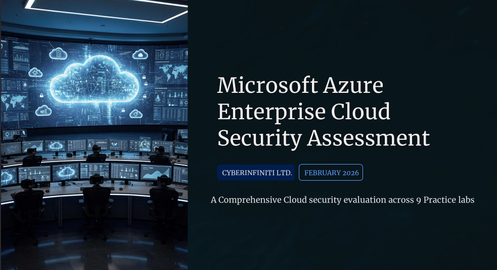

# Security Operations Center (SOC) Enterprise Cloud Security Assessment Report

  

## Microsoft Azure Enterprise Cloud Security Assessment

**Organization:** Redacted Tech Ltd.  
**Report ID:** TIR-CTI-2026-INT-002  
**Report Date:** February 2026  
**Classification:** Confidential / Internal Use  
**Analysts:** Team Redacted (9 members)  
**Report Version:** 1.0  
**Distribution:** SOC Team, Executive Management

---

## Table of Contents

1. [Executive Summary](#executive-summary)  
2. [Scenario Overview & Objectives](#scenario-overview--objectives)  
   1. [Scenario Overview](#scenario-overview)  
   2. [Assessment Objectives](#assessment-objectives)  
3. [Scope of Assessment](#scope-of-assessment)  
4. [Azure Environment Setup & Subscription Configuration](#azure-environment-setup--subscription-configuration)  
   1. [Subscription and Access Model](#subscription-and-access-model)  
   2. [Design Principles](#design-principles)  
5. [Methodology & Tooling](#methodology--tooling)  
   1. [Assessment Methodology](#assessment-methodology)  
   2. [Tooling and Technologies](#tooling-and-technologies)  
6. [Lab 01: Role-Based Access Control](#lab-01-role-based-access-control)  
7. [Lab 02: Network Security Groups and Application Security Groups](#lab-02-network-security-groups-and-application-security-groups)  
8. [Lab 03: Azure Firewall](#lab-03-azure-firewall)  
9. [Lab 04: Configuring and Securing ACR and AKS](#lab-04-configuring-and-securing-acr-and-aks)  
10. [Lab 05: Service Endpoints and Securing Storage](#lab-05-service-endpoints-and-securing-storage)  
11. [Lab 06: Log Analytics Workspace, Storage Account, and DCR](#lab-06-log-analytics-workspace-storage-account-and-dcr)  
12. [Lab 07: Microsoft Defender for Cloud](#lab-07-microsoft-defender-for-cloud)  
13. [Lab 08: Just-In-Time VM Access](#lab-08-just-in-time-vm-access)  
14. [Lab 09: Microsoft Sentinel](#lab-09-microsoft-sentinel)  
15. [Key Assessment Areas & Findings](#key-assessment-areas--findings)  
16. [Strategic Risk Insights](#strategic-risk-insights)  
17. [Executive Recommendations](#executive-recommendations)  
18. [Conclusion](#conclusion)  
19. [References](#references)  
20. [Appendices](#appendices)  

---

## Executive Summary

This report presents the results of a comprehensive Enterprise Cloud Security Assessment conducted within a Microsoft Azure production-like environment. Nine practice labs evaluated cloud security posture across identity governance, access control, monitoring, threat detection, and incident response.  

Key highlights:

- Azure-native security services can reduce attack surface, improve visibility, and enable rapid incident response.  
- Emphasis on preventive, detective, and responsive controls in line with **Zero Trust Architecture**.  
- Strategic gaps identified in configuration complexity, governance consistency, and skills dependency.

---

## Scenario Overview & Objectives

### Scenario Overview

Redacted Tech Ltd operates as a technology and cybersecurity-focused organization leveraging Microsoft Azure for workloads, identities, and security operations. The assessment simulated realistic enterprise conditions to evaluate the effectiveness of Azure-native security tools.  

### Assessment Objectives

1. Evaluate identity and access controls for least privilege enforcement.  
2. Assess centralized visibility and monitoring across workloads.  
3. Detect misconfigurations, vulnerabilities, and active threats.  
4. Measure attack surface reduction effectiveness.  
5. Demonstrate incident detection and automated response aligned with SOC operations.  
6. Translate technical findings into executive-level insights.

---

## Scope of Assessment

**Focus Areas:**

- **Identity and Access Management (IAM):** Microsoft Entra ID & RBAC, enforcing least privilege and role separation.  
- **Monitoring & Logging:** Azure Monitor, Log Analytics, DCRs, ensuring visibility into user behavior and configuration changes.  
- **Cloud Workload Protection & Posture Management:** Using Defender for Cloud and CSPM to secure VMs, containers, and serverless workloads.  
- **Privileged Access:** Just-In-Time access via PIM for critical roles.  
- **SIEM, SOAR, and Incident Response:** Microsoft Sentinel and Logic Apps enabled automated detection, investigation, and response.

---

## Azure Environment Setup & Subscription Configuration

### Subscription and Access Model

- **Pay-As-You-Go subscription:** Only pay for resources used.  
- **Contributor & Owner roles:** Owner has full management; Contributor can deploy and manage resources but not assign roles.  
- **Dedicated Entra ID tenant:** Isolated identity management for governance and security.

### Design Principles

- **Least Privilege Access & IAM Enforcement**  
- **Group-Based RBAC**  
- **Resource Group Segmentation**  
- **Azure-Native Security Tooling Adoption**

---

## Methodology & Tooling

### Assessment Methodology

1. Planning & Direction  
2. Environment Review  
3. Control Implementation & Validation  
4. Threat Simulation & Observation  
5. Risk Analysis  
6. Reporting  

### Tooling and Technologies

- **Microsoft Entra ID (Azure AD)**  
- **Azure RBAC**  
- **Azure Monitor & Log Analytics**  
- **Data Collection Rules (DCRs)**  
- **Microsoft Defender for Cloud (Servers Plan 2)**  
- **Just-In-Time VM Access**  
- **Azure Logic Apps**  
- **Microsoft Sentinel (SIEM & SOAR)**  

---

## Lab Highlights

### Lab 01: Role-Based Access Control

- Created user groups: **Senior Admins**, **Junior Admins**, **Service Desk**  
- Assigned **Virtual Machine Contributor** role to Service Desk group.  

### Lab 02: Network Security Groups & Application Security Groups

- Created virtual networks, NSGs, and ASGs.  
- Restricted RDP access to Management Servers and enabled web access for Web Servers.

### Lab 03: Azure Firewall

- Deployed and tested Azure Firewall to control inbound/outbound traffic.  
- Implemented network and application rules for secure traffic management.

### Lab 04: Configuring and Securing ACR and AKS

- Created **Azure Container Registry** and **AKS cluster**.  
- Deployed external and internal services securely using containers.

### Lab 05: Service Endpoints & Securing Storage

- Configured storage endpoints to ensure traffic remains on Azure backbone.  
- Restricted access based on subnet assignment.

### Lab 06: Log Analytics Workspace, Storage Account, and DCR

- Deployed VM, Log Analytics workspace, and Azure storage account.  
- Configured DCRs to collect telemetry and logs for monitoring.

### Lab 07: Microsoft Defender for Cloud

- Enabled enhanced security features for servers.  
- Applied Plan 2 for advanced threat detection and vulnerability management.

### Lab 08: Just-In-Time VM Access

- Configured JIT access for critical VMs, limiting exposure to RDP/SSH.  

### Lab 09: Microsoft Sentinel

- Onboarded Sentinel, connected Azure Activity logs.  
- Created custom rules and playbooks for automated incident response.

---

## Key Assessment Areas & Findings

- **Identity & Access Management:** Enforced least privilege, group-based RBAC, resource segmentation.  
- **Monitoring, Logging & Visibility:** Centralized telemetry, DCRs, log aggregation for real-time monitoring.  
- **Threat Protection & Security Posture Management:** Defender for Cloud Plan 2 ensured continuous security.  
- **Attack Surface Reduction:** JIT VM access, resource segmentation, and least-privilege policies applied.  
- **Detection, Incident Response & Automation:** Sentinel and Logic Apps automated threat detection and response.

---

## Strategic Risk Insights

- Excessive privileges remain a high-impact risk without continuous governance.  
- Centralized visibility is critical for early threat detection.  
- Automation is essential for scalable SOC operations.  
- Advanced features require appropriate licensing and skilled configuration.

---

## Executive Recommendations

1. **Enforce Least-Privilege Access**  
2. **Strengthen Visibility & Monitoring**  
3. **Automate Security Operations**  
4. **Leverage Advanced Security Features**  
5. **Regularly Review & Harden Resources**

---

## Conclusion

Redacted Tech Ltd can achieve a resilient and scalable cloud security posture by leveraging Azure-native tools with governance, automation, and skilled operations. Key areas include IAM, Monitoring, Threat Protection, Attack Surface Reduction, and Incident Response. Implementing these practices ensures secure, compliant, and efficient cloud adoption.

---

## References

- **AZ500-Azure Security Technology** – [GitHub Repository](https://github.com/MicrosoftLearning/AZ500-AzureSecurityTechnologies/tree/master/Allfiles/Labs/08)  
- **Microsoft Azure Documentation** – [Microsoft Learn](https://learn.microsoft.com/azure/)

---

## Appendices

### Appendix A: Sprint Timeline & Meetings

| Date         | Time     | Attendees                  |
|--------------|---------|----------------------------|
| 2nd Feb 2026 | 8:10 PM | Team Redacted              |
| 3rd Feb 2026 | 8:10 PM | Team Redacted              |
| 4th Feb 2026 | 8:10 PM | Team Redacted              |
| 5th Feb 2026 | 8:10 PM | Team Redacted              |
| 6th Feb 2026 | 8:10 PM | Team Redacted              |
| 7th Feb 2026 | 8:10 PM | Team Redacted              |

### Appendix B: Team Contributions

| Name          | Role / Responsibility |
|---------------|--------------------|
| Team Lead     | Managed tasks, guided labs & report compilation |
| Assistant Lead| Supported presentations and lab execution |
| Lab Specialists| Conducted labs 5–9 and contributed to documentation |
| Presenters    | Delivered lab outcomes and demos |
| Documentation | Compiled, edited, and organized report content |
