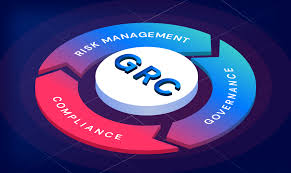

# GRC Enterprise Information Security Framework

    

**Organization:** Cyberinfiniti Ltd.  
**Project:** Policy Development & Compliance Framework Implementation  
**Report ID:** `CIF-GRC-PDCR-2026-02`  
**Date:** February 2026  
**Classification:** Confidential / Internal Use  

---

## 📑 Table of Contents
1. [Executive Summary](#10-executive-summary)
2. [Team & Contributions](#20-team--contributions)
3. [Methodology](#30-methodology)
4. [Policy Framework Overview](#40-policy-framework-overview)
5. [Governance & Roles](#50-governance--roles)
6. [Regulatory Alignment (NDPA 2023)](#60-regulatory-alignment)
7. [Strategic Recommendations](#70-strategic-recommendations)

---

    

## 1.0 Executive Summary
This repository documents the Governance, Risk, and Compliance (GRC) sprint conducted for **Cyberinfiniti Ltd**. The project established a formal security governance infrastructure aligned with **ISO/IEC 27002:2022** and the **Nigeria Data Protection Act (NDPA) 2023**. 

By formalizing ten core enterprise policies, Cyberinfiniti Ltd has moved from informal operational controls to a measurable, auditable, and resilient security posture.

---

## 2.0 Team & Contributions
The following analysts were responsible for the research, drafting, and implementation of this framework:

| Name | Project Role | Policy Contribution |
| :--- | :--- | :--- |
| **John Ofulue** | Managing Director / Lead | InfoSec Policy, AI Governance, BCDR |
| **Halimat O. Adepegba** | GRC Manager / Asst. Lead | Clear Desk & Clear Screen Policy |
| **Ikenna Emerole** | CISO | AI Policy & Executive Review |
| **Ayodimeji Omole** | SOC Manager | Incident Management Policy |
| **Odunayo Balogun** | IAM Specialist | Information Classification Policy |
| **Favour Obisike** | Head of Security Engineering | Privileged Access Management (PAM) |
| **Andrew Moses** | IT Operations Lead | ISO Alignment & Technical Proofreading |
| **Blessing Ibe** | HR Manager | Third-Party & Vendor Management |
| **Divine Ezewele** | Legal & Compliance Officer | Identity Management & Access Control |

---

## 3.0 Methodology
The framework was developed using a structured six-phase approach:
1. **Gap Assessment:** Identified deficiencies in existing informal controls.
2. **Regulatory Alignment:** Mapped requirements to ISO 27002 and NDPA 2023.
3. **Risk Contextualization:** Tailored controls to the specific threats facing a cybersecurity firm.
4. **Policy Drafting:** Created mandatory, testable, and control-driven statements.
5. **Governance Assignment:** Defined accountability through a RACI-style structure.
6. **Framework Integration:** Established a continuous monitoring model.

---

## 4.0 Policy Framework Overview
The following policies form the core of the Cyberinfiniti Ltd security infrastructure:

### 🔐 Core Security Policies
* **Information Security Policy (ISO 5.1):** The primary governance document defining management commitment and the CIA triad.
* **Information Classification Policy (ISO 5.12):** Establishes categories (Public, Internal, Confidential, Restricted) and handling rules.
* **Identity & Access Control (ISO 5.16):** Mandates unique identification, MFA, and least-privilege access.
* **Privileged Access Management (PAM):** Strict controls for administrative credentials and "just-in-time" access.

### 🤖 Emerging Tech & Operations
* **AI Governance Policy:** Defines acceptable/prohibited use of AI tools to prevent data leakage.
* **Incident Management (ISO 5.24):** A full lifecycle approach: Detection → Containment → Eradication → Lessons Learned.
* **Vulnerability Management:** Defines scanning frequencies and remediation timelines based on risk severity.

### 🏢 Physical & Third-Party Security
* **Clear Desk & Clear Screen:** Mandatory physical security standards for the workplace.
* **Third-Party & Vendor Management:** Security due diligence and contractual obligations for all suppliers.
* **Business Continuity & BCDR (ISO 5.29):** Resilience planning, ICT readiness, and disaster recovery testing.

---

## 5.0 Governance & Roles
Effective governance is managed through assigned accountability:

* **Managing Director:** Approving Authority & Executive Oversight.
* **CISO:** Strategic Direction & Policy Ownership.
* **GRC Manager:** Policy Development & Compliance Monitoring.
* **SOC Manager:** Operational Security & Incident Response.
* **IT Operations Lead:** Infrastructure Security & Containment.

---

## 6.0 Regulatory Alignment
This framework ensures full compliance with the **Nigeria Data Protection Act (NDPA) 2023**:
* **Data Minimization:** Ensuring only necessary data is processed.
* **Lawful Basis:** Defining the legal grounds for all data handling.
* **Breach Notification:** Standardized procedures for reporting incidents to regulatory bodies.

---

## 7.0 Strategic Recommendations
To maintain the integrity of this framework, Cyberinfiniti Ltd will:
1. Conduct **Quarterly Access Reviews** for all restricted systems.
2. Perform **Annual Policy Reviews** or updates following significant security incidents.
3. Automate compliance tracking through a **GRC Dashboard**.
4. Facilitate **Monthly Security Awareness** training for all staff and contractors.

---
**Reviewer:** Chief Information Security Officer (CISO)  
**Approver:** Managing Director  
**Version:** 1.0  
**Distribution:** CyBlack Team, SOC Team, Executive Management
