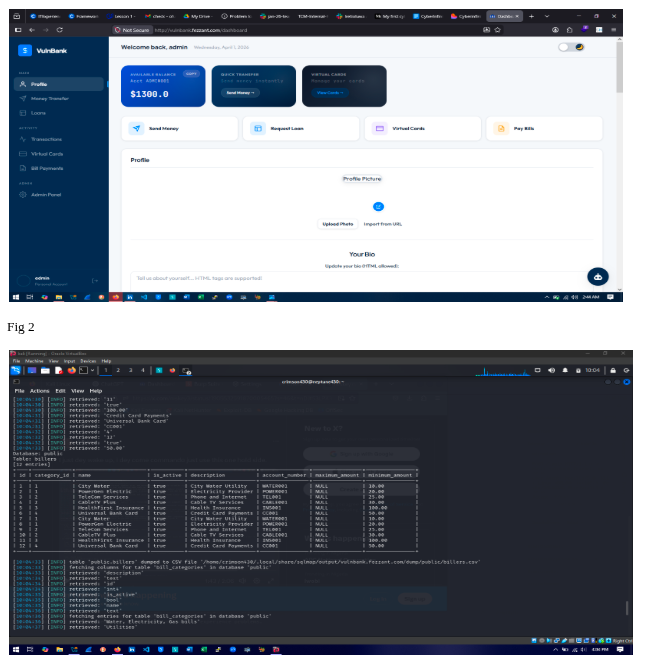

# 🛡️ Enterprise Penetration Testing: VulnBank Web Application

    

**Organization:** `Cyberinfiniti Ltd.`  
**Project:** Ethical Hacking & Security Assessment  
**Target:** `VulnBank Web Application` (vulnbank.fezzant.com)  
**Report ID:** `PT-VB-2026-INT-001`  
**Classification:** 🔴 Confidential / Internal Use  
**Engagement Type:** Simulated Penetration Test (Controlled Lab Environment)

---

## 📑 Table of Contents
- [1.0 Executive Summary](#10-executive-summary)
- [2.0 Detailed Analyst Contributions](#20-detailed-analyst-contributions)
- [3.0 Assessment Scope & Methodology](#30-assessment-scope--methodology)
- [4.0 Vulnerability Register (Report Card)](#40-vulnerability-register-report-card)
- [5.0 Technical Findings & Exploitation](#50-technical-findings--exploitation)
- [6.0 Post-Exploitation & AI Security](#60-post-exploitation--ai-security)
- [7.0 Remediation Roadmap](#70-remediation-roadmap)

---

    

## 1.0 Executive Summary
This report details the security assessment of the **VulnBank** web application. The engagement utilized a "Black Box" approach to identify critical weaknesses that could lead to unauthorized data access, financial fraud, or system compromise.

### Key Insights:
- [x] **Critical Vulnerabilities:** Identified SQL Injection and Broken Access Control.
- [x] **AI Security:** Exploited Prompt Injection vulnerabilities in the integrated AI chatbot.
- [x] **Data Exposure:** Successfully exfiltrated sensitive database records and administrative credentials.
- [x] **Risk Level:** **CRITICAL**. Immediate remediation is required to prevent real-world exploitation.

---

## 2.0 Detailed Analyst Contributions
The assessment was executed by a specialized "Red Team" of security analysts:

| Analyst | Core Functional Responsibility |
| :--- | :--- |
| **John Ofulue** | **Team Lead:** Project management; exploitation of SQL Injection; final report synthesis. |
| **Halimat O. Adepegba** | **Asst. Team Lead:** Information gathering; reconnaissance; technical reporting. |
| **Andrew Moses** | **Exploitation Specialist:** Identified critical vulnerabilities; worked on exploitation and presentation slides. |
| **Odunayo Balogun** | **Exploitation Specialist:** Contributed to vulnerability findings, exploitation, and technical slides. |
| **Ikenna Emerole** | **AI Security:** Specialized in AI Prompt Injection and technical report compilation. |
| **Favour Obisike** | **Technical Editor:** Compiled findings and managed the final report structure. |
| **Ayodimeji Omole** | **Reviewer:** Compiled and modified the report; performed quality assurance. |
| **Blessing Ibe** | **Analyst:** Report modification; created Appendix B & C (Sprint Timelines). |
| **Divine Ezewele** | **Presenter:** Led the technical sprint presentation for stakeholders. |

---

## 3.0 Assessment Scope & Methodology
The engagement followed the **OWASP Testing Guide** and **PTES** frameworks:

1. **Reconnaissance:** Passive and active enumeration of the application architecture.
2. **Vulnerability Analysis:** Automated and manual scanning for OWASP Top 10 risks.
3. **Exploitation:** Safely demonstrating the impact of identified weaknesses.
4. **Post-Exploitation:** Assessing the depth of access and potential for lateral movement.

---

## 4.0 Vulnerability Register (Report Card)

| ID | Finding | Severity | Status |
| :--- | :--- | :--- | :--- |
| **VB-001** | SQL Injection (Authentication Bypass) | 🔴 Critical | Exploited |
| **VB-002** | Broken Access Control (IDOR) | 🟠 High | Validated |
| **VB-003** | AI Prompt Injection | 🟠 High | Exploited |
| **VB-004** | Sensitive Data Exposure | 🟡 Medium | Validated |
| **VB-005** | Security Misconfiguration | 🔵 Low | Validated |

---

## 5.0 Technical Findings & Exploitation

### 5.1 SQL Injection (VB-001)
> [!CAUTION]
> **Impact:** Complete database compromise.
The login interface was found vulnerable to classic SQL Injection. By injecting `' OR 1=1 --`, analysts bypassed authentication to access administrative dashboards without valid credentials.

### 5.2 Broken Access Control (VB-002)
Analysts identified **Insecure Direct Object References (IDOR)**. By modifying the `account_id` parameter in the URL, users could view and modify the financial details of other customers.

---

## 6.0 Post-Exploitation & AI Security

### 🤖 AI Functionality Testing
The VulnBank AI chatbot was tested for **Prompt Injection**. By using specialized "jailbreak" prompts, analysts forced the AI to reveal internal system instructions and sensitive developer notes, bypassing the safety filters.

### 💾 Data Exfiltration
Using the SQLi vector, the team successfully dumped the `users` table, revealing:
* Plaintext/Weakly hashed passwords.
* Personal Identifiable Information (PII).
* Transaction histories.

---

## 7.0 Remediation Roadmap
To secure the VulnBank environment, the following actions are mandated:

1. **Immediate:** Implement **Parameterized Queries** and Prepared Statements to neutralize SQL Injection.
2. **Immediate:** Enforce **Server-Side Authorization** checks for all object-based requests.
3. **Short-Term:** Sanitize and validate all inputs for the AI Chatbot and implement robust output filtering.
4. **Ongoing:** Conduct regular **Authenticated Penetration Tests** and implement a Web Application Firewall (WAF).

---
**Approved By:** Managing Director  
**Reviewed By:** Chief Information Security Officer (CISO)  
**Project Status:** 🏁 Completed
